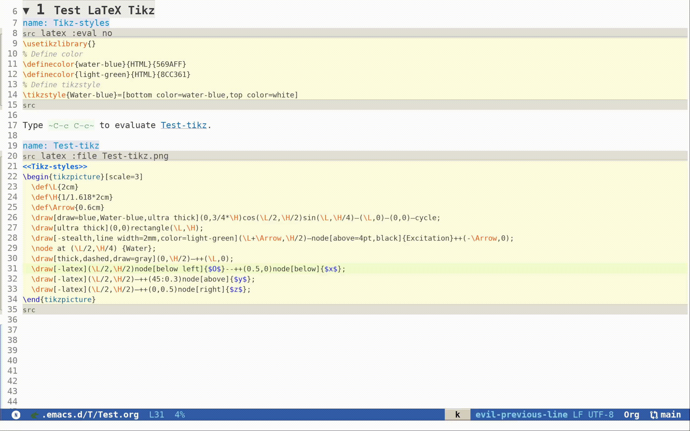

# Sci-Emacs

**Author:** Peng Peng  \
**Email:** [211110103110@stu.just.edu.cn](mailto:211110103110@stu.just.edu.cn)  \
**GitHub:** [TurbulenceChaos/Sci-Emacs](https://github.com/TurbulenceChaos/Sci-Emacs) \
**Environment:** (emacs "30.1" in WSL2 Ubuntu 24.04)

---
## Table of Contents
- [Sci-Emacs](#sci-emacs)
  - [Table of Contents](#table-of-contents)
  - [1. Introduction](#1-introduction)
  - [2. Installation](#2-installation)
  - [3. Testing Setup](#3-testing-setup)
    - [3.1 Latex Tikz](#31-latex-tikz)
    - [3.2 Jupyter Wolfram Language](#32-jupyter-wolfram-language)

## 1. Introduction
This is my personal emacs configuration, specifically aimed at academic research.

## 2. Installation
```bash
# Clone the Sci-Emacs repository into the emacs directory
git clone https://github.com/TurbulenceChaos/Sci-Emacs.git ~/.emacs.d

cd ~/.emacs.d

# Install `ispell` for `spell-checking` support
sudo apt install ispell
```

## 3. Testing Setup
Verify setup in [Test.org](Test/Test.org).

### 3.1 Latex Tikz
Demo: [Test-org-babel-tikz.gif](Test/Test-org-babel-tikz.gif) 



### 3.2 Jupyter Wolfram Language
You can find my [Wolfram-terminal-image](https://github.com/TurbulenceChaos/Wolfram-terminal-image) package on GitHub, which allows wolfram images to be shown in the vscode terminal and emacs org-mode.

Demo: [Test-emacs-jupyter-wolfram-language.gif](Test/Test-emacs-jupyter-wolfram-language.gif)


